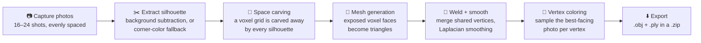

# 🧊 3D Object Scanner

**Turn a real-world object into an interactive, colored 3D model using nothing but a phone or webcam camera.**

No app install. No LiDAR. No server. One HTML file, a handful of photos, and some computer vision math running entirely in your browser.


---

## Table of Contents

- [Overview](#overview)
- [Quick Start](#quick-start)
- [How It Works](#how-it-works)
- [Project Structure](#project-structure)
- [Tech Stack](#tech-stack)
- [Deploying to GitHub Pages](#deploying-to-github-pages)
- [Tips for Best Results](#tips-for-best-results)
- [Limitations](#limitations)
- [Troubleshooting](#troubleshooting)
- [Roadmap](#roadmap)
- [Contributing](#contributing)
- [License](#license)
- [Acknowledgments](#acknowledgments)

---

## Overview

Point your camera at an object, walk around it (or spin it in place), and this app reconstructs a real, exportable 3D mesh — colored using the actual pixels from your photos. It's a single self-contained `index.html`: no build pipeline, no package manager, no backend.

**Highlights:**

- 📸 **Guided capture** — a live camera view with a progress ring, or a native-camera fallback if `getUserMedia` isn't available
- 🧊 **Real reconstruction, not a placeholder** — a genuine space-carving (visual hull) pipeline, validated against synthetic test shapes during development (see [How It Works](#how-it-works))
- 🎨 **Photo-accurate coloring** — every vertex is colored by sampling the photo that saw it most directly
- 🖱️ **Interactive 3D viewer** — drag to orbit, scroll or pinch to zoom, auto-rotate
- ⬇️ **Real export** — a `.obj` (geometry) and `.ply` (geometry + vertex colors) bundled into a `.zip`, ready for Blender, MeshLab, or any standard 3D tool
- 🧠 **Self-correcting capture** — each photo is silently graded as it's taken, and flagged if its silhouette looks unreliable

## Quick Start

**Option A — just open it.** Download or clone this repo and open `index.html` directly. The reconstruction pipeline works immediately; see [Troubleshooting](#troubleshooting) if the *live camera preview* specifically doesn't appear.

**Option B — serve it locally** (recommended, since `getUserMedia` prefers a secure context):

```bash
git clone https://github.com/<your-username>/<your-repo>.git
cd <your-repo>
python3 -m http.server 8000
# then open http://localhost:8000 in your browser
```

**Option C — deploy it** so it's on HTTPS and shareable — see [Deploying to GitHub Pages](#deploying-to-github-pages).

Once it's open:

1. Optionally photograph the empty background (improves accuracy).
2. Take 16–24 photos evenly spaced around your object.
3. Tap **Reconstruct 3D Model**.
4. Rotate/zoom the result, then **Export** it as a `.zip`.

## How It Works

This is **silhouette-based 3D reconstruction** — sometimes called *space carving* or *shape-from-silhouette*. It's a different (and much lighter-weight) technique than LiDAR scanning or full photogrammetry, both of which typically need depth sensors or heavy server-side processing that a single static web page can't do on its own.



**Stage by stage:**

| Stage | What happens |
|---|---|
| **Silhouette extraction** | Each photo is compared pixel-by-pixel against an optional background reference (or, without one, against its own corner colors as a rough estimate of the background). The result is cleaned up with a border flood-fill — this closes small holes and discards any speckle noise that isn't part of the single largest connected blob. |
| **Space carving** | A 3D voxel grid (44³ cells) starts completely solid. For each photo — assumed to sit at an even angular step around a turntable rotation — every voxel is projected into that photo's camera view. Any voxel that lands outside the silhouette gets carved away. What survives every single photo approximates the object's *visual hull*. |
| **Meshing** | Every exposed face between a solid and an empty voxel becomes two triangles, with outward-facing winding computed per direction. |
| **Welding & smoothing** | Coincident vertices (shared by neighboring voxel faces) are merged using their exact lattice coordinates, then a handful of Laplacian smoothing passes relax the blocky voxel surface into something more organic. |
| **Coloring** | For each vertex, the app compares its surface normal against every camera's viewing direction, picks whichever photo was looking most directly at that point, and samples the color straight from that photo's pixels. |
| **Export** | The final geometry is serialized as both `.obj` (widely compatible) and `.ply` (keeps vertex colors), zipped together with a short README, and downloaded. |

**On accuracy:** during development, the carving math was validated against a synthetic sphere reconstructed from 18 simulated silhouette views — it came back within ~12% of the sphere's true volume, with the tightest accuracy around the equator (matching what you'd expect from a turntable-style capture that never looks straight down or up).

## Project Structure

```
3d-object-scanner/
├── index.html   ← the entire app (~1,100 lines: markup, styles, and logic)
└── README.md    ← this file
```

Everything lives in one file by design — drop it anywhere and it runs. If you're digging into the code, `index.html` is organized into clearly labeled sections in order:

| Section | Roughly what's there |
|---|---|
| `Constants` | Voxel grid resolution, capture sizes, assumed virtual camera parameters |
| `State` / `Downloads capability` | Global app state; detects Claude's artifact download API when present |
| `Screen navigation` | Switches between the welcome / capture / processing / result screens |
| `Camera handling` | `getUserMedia` setup, with fallback wiring for file-based capture |
| `Frame capture helpers` | Square-cropping a video frame or image file into a capture canvas |
| `Mask extraction` | Background subtraction / corner-sampling + flood-fill cleanup |
| `Capture management` | Storing captures, quality-flagging, thumbnail rendering |
| `Voxel carving` | Builds the turntable cameras and carves the voxel grid |
| `Meshing` | Converts surviving voxels into a triangle mesh |
| `Welding & smoothing` | Vertex welding, adjacency graph, Laplacian smoothing |
| `Vertex coloring from photos` | Samples color per vertex from the best-facing photo |
| `Reconstruction pipeline` | Orchestrates the above, stage by stage, with progress updates |
| `Result viewer (Three.js)` | Scene setup, custom drag/zoom camera controls, render loop |
| `Export` | Builds `.obj` / `.ply` text and packages them via JSZip |
| `Event wiring` | Hooks up every button and file input |

## Tech Stack

- **Vanilla HTML / CSS / JavaScript** — no framework, no bundler, no `node_modules`
- **[Three.js r128](https://threejs.org/)** — 3D viewer rendering and the camera-projection math reused for voxel carving
- **[JSZip 3.10.2](https://stuk.github.io/jszip/)** — packages the exported model files into a single `.zip`
- **Browser APIs** — `getUserMedia`, `<canvas>` / `ImageData`, `<input type="file" capture>` as an automatic fallback

Both libraries load from a public CDN at runtime — there's nothing to install.

## Deploying to GitHub Pages

1. Push this folder to a GitHub repository.
2. Go to **Settings → Pages**.
3. Under **Build and deployment**, set **Source** to "Deploy from a branch," choose your default branch and the `/ (root)` folder, then save.
4. Your scanner goes live at `https://<your-username>.github.io/<repo-name>/` — served over HTTPS by default, so the live camera preview works immediately with no extra setup.

## Tips for Best Results

- Use a **plain, contrasting background** — a table, floor, or sheet of paper works well.
- Keep the object **centered** and roughly the **same distance** from the camera in every shot.
- Space photos **evenly around a full 360°** turn — the reconstruction assumes even spacing.
- Use **soft, even lighting**; harsh directional shadows can confuse silhouette extraction.
- Capture the **optional background reference** photo first — it noticeably improves the silhouette quality over the corner-color fallback.
- If a thumbnail gets flagged (⚠️) after capture, consider retaking that one before reconstructing.

## Limitations

This is an approximation technique, not a measurement-grade scanner:

- **Concavities are invisible to silhouettes.** The inside of a bowl or a deep recess won't be captured — silhouette carving only recovers the outer visual hull.
- **Tops and bottoms are softer.** Photos are taken roughly at the object's height, so the poles (directly above/below) are less constrained than the sides.
- **Thin or dark, non-reflective, or transparent objects** are hard for basic background-subtraction to separate cleanly.
- **Scale is relative, not absolute.** The reconstruction doesn't know the object's real-world size.
- It's not LiDAR and it's not full photogrammetry — it trades some fidelity for running entirely client-side, in a browser, with zero setup.

## Troubleshooting

<details>
<summary><strong>The live camera preview doesn't appear</strong></summary>

`getUserMedia` requires a secure context (HTTPS or `localhost`) — it's blocked on plain `file://` pages by most browsers. Serve the folder locally (see [Quick Start](#quick-start)) or deploy it (see [Deploying to GitHub Pages](#deploying-to-github-pages)). Either way, the app detects this automatically and falls back to a "Take Photo" button that opens your device's native camera app instead, so scanning still works.
</details>

<details>
<summary><strong>The reconstruction failed / came back empty</strong></summary>

This means the silhouettes didn't overlap into a solid shape — usually caused by a busy background, uneven lighting, or the object moving off-center between shots. Retake with a plainer background and keep the object centered, then try again.
</details>

<details>
<summary><strong>The model looks blocky or has rough edges</strong></summary>

More photos help the most — aim for 18–24 spaced evenly around a full turn. A cleaner silhouette (plain background, even lighting, a captured background reference) also goes a long way.
</details>

<details>
<summary><strong>Export doesn't download anything</strong></summary>

The app tries a platform-provided download API first (when running as a hosted Claude artifact) and falls back to a standard browser download otherwise. If neither fires, check your browser's download/pop-up permissions for the page.
</details>

## Roadmap

Ideas for anyone who wants to extend this:

- [ ] Adjustable voxel resolution (quality vs. speed trade-off)
- [ ] A live silhouette preview during capture, so bad lighting is obvious before reconstructing
- [ ] Device-orientation input to relax the "evenly spaced" turntable assumption
- [ ] `.glb`/`.gltf` export alongside `.obj`/`.ply`
- [ ] Marching-cubes meshing for a smoother surface than culled-voxel-face + Laplacian smoothing

## Contributing

Issues and pull requests are welcome. Since everything lives in one file, the [Project Structure](#project-structure) section above should help you find the right spot to work in. Please keep the project dependency-free (CDN-loaded libraries only) and keep the file self-contained.

## License

No license file is included yet. If you plan to share or open-source this project, add a `LICENSE` file of your choice — [MIT](https://choosealicense.com/licenses/mit/) is a common, permissive default for a project this size.

## Acknowledgments

- [Three.js](https://threejs.org/) for 3D rendering and projection math
- [JSZip](https://stuk.github.io/jszip/) for in-browser `.zip` packaging
- Built with [Claude](https://claude.ai)
